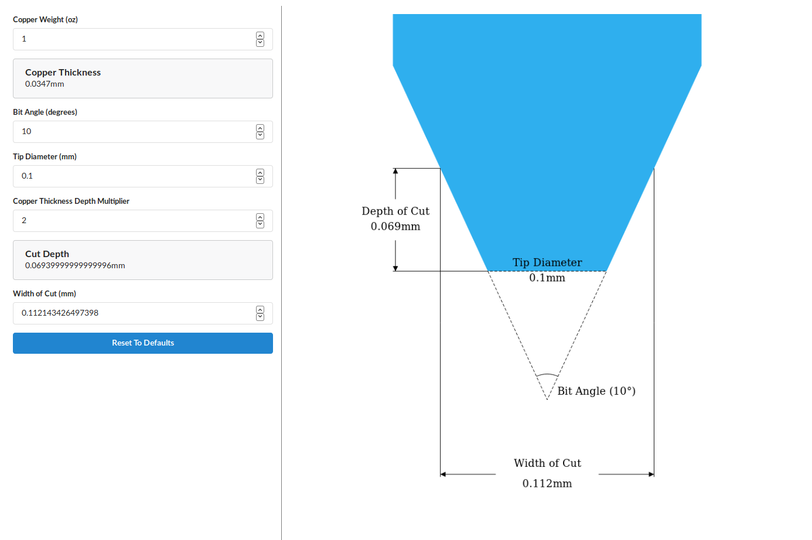

# Engraving Depth Calculator
The HTML in this repo is designed to be used for calculating the depth and cut width of V-shaped engraving bits. It includes a visual representation to aid in calculations.

